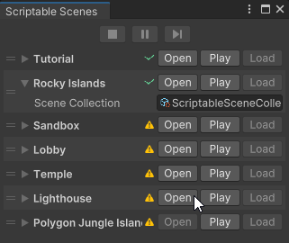

# Scriptable Scenes

[](https://unity3d.com/get-unity/download)
[](https://openupm.com/packages/com.chark.scriptable-scenes/)
[](https://github.com/chark/scriptable-scenes/actions)

Simple scene loading and management system for Unity Engine, implemented via Scriptable Objects.

<p align="center">
  
</p>

:warning: **Warning, this is a preview package, expect breaking changes between releases!**

## Features

- Use assets to reference scenes instead of hard-coding paths or build indexes
- Easily load and unload sets of scenes
- Additively loaded scenes
- Persistent scenes (setup/preload/boostrap scene)
- Custom transition support
- Unity Event support
- Odin Inspector support

## Installation

This package can be installed via [OpenUPM](https://openupm.com/packages/com.chark.scriptable-scenes):
```text
openupm add com.chark.scriptable-scenes
```

Or via the Unity Package Manager by [Installing from a Git URL](https://docs.unity3d.com/Manual/upm-ui-giturl.html):

```text
https://github.com/chark/scriptable-scenes.git#upm
```

Alternatively, manually install by adding the following entry to `Packages/manifest.json`:
```json
{
  "com.chark.scriptable-scenes": "https://github.com/chark/scriptable-scenes.git#upm"
}
```

If you'd like to install a specific release, replace `upm` suffix with version number, e.g., `v0.0.10`. You can find all releases [here](https://github.com/chark/scriptable-scenes/releases).

## Links

- [Documentation](../Packages/com.chark.scriptable-scenes/Documentation~/README.md)
- [Contributing](CONTRIBUTING.md)
- [Changelog](../Packages/com.chark.scriptable-scenes/CHANGELOG.md)
