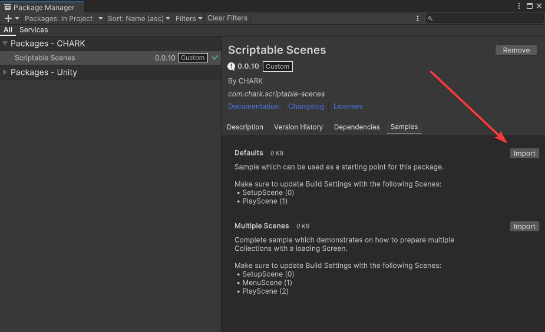
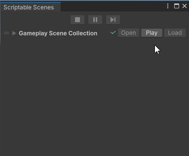

[Unity Package Manager]: https://docs.unity3d.com/Manual/upm-ui.html
[Samples~]: ../Samples%7E

[Scriptable Scene]: ../Runtime/ScriptableScene.cs
[Scriptable Scene Collection]: ../Runtime/ScriptableSceneCollection.cs
[Scriptable Scene Controller]: ../Runtime/ScriptableSceneController.cs

[Scriptable Scene Transition]: ../Runtime/Transitions/ScriptableSceneTransition.cs
[Fade Canvas]: ../Runtime/Transitions/FadeCanvas.cs

# Documentation

## Getting Started

Open [Unity Package Manager], select _Scriptable Scenes_ package and import _Defaults_ sample:

  

Make sure _SetupScene_ and _PlayScene_ are added to _Build Settings_:

  

Open _Scriptable Scene_ window by selecting _Window/CHARK/Scriptable Scenes_ menu item:

  

Select the action to perform with _Default_ collections imported from the sample:

  

- **Open** - open selected collection in scene view & hierarchy.
- **Play** - start the game and load selected collection.
- **Load** - load selected collection, only available during play mode. This is handy to quickly switch between the scenes when the game is running.

## Creating a new collection

To create a new collection you'll need the following:

- [Scriptable Scene] asset.
- [Scriptable Scene Collection] asset.
- [Scriptable Scene Controller] component.

And **optionally**:

- [Scriptable Scene Transition] asset.
- [Fade Canvas] component.

### Scriptable Scene

First you'll need to define scenes which go into the collection. Instead of specifying a hard-coded scene path or build index, this package provides a way to safety refer to scenes via Scriptable Objects (_Scriptable Scene_ assets).

To create a _Scriptable Scene_ asset, right-click in the _Project Window_ and select _Create/CHARK/Scriptable Scenes/Scriptable Scene_:

  
  

You can adjust the following properties on this asset:

- **Scene Asset** - the `.unity` scene this asset is referring to. Drag in the scene file this asset is referring to.
- **Pretty Name** - user-defined name for the scene. If left blank, a default name will be used.
- **Is Active** - should this scene be activated when it gets loaded by a collection? Set this to `true` for gameplay scenes.
- **Is Persist** - should this scene never be unloaded, even when switching collections? Set this to `true` for setup/preload scenes.
- **Scene Events** - events invoked on this scene.

### Scriptable Scene Collection

Once you have defined a set of _Scriptable Scene_ assets, you'll need to create a _Scriptable Collection_ asset which will be used to group and load a set of scenes at the same time. Loading will be done additively.

To create a _Scriptable Scene Collection_ asset, right-click in the _Project Window_ and select _Create/CHARK/Scriptable Scenes/Scriptable Scene Collection_:

  

You can adjust the following properties on this asset:

- **Pretty Name** - user-defined name for the collection. If left blank, a default name will be used.
- **Transition** - _Scriptable Scene Transition_ asset which can be used to smoothly transition between scenes. If left unset, no transitions will be used.
- **Scriptable Scenes** - scenes to load when this collection is loaded. The order of the scenes in this list defines how they appear in the scene hierarchy.
- **Collection Events** - events invoked on this collection.
- **Scene Events** - events invoked on any of scenes in this collection.
- **Actions** - set of actions that can be performed with this collection. These are the same actions as in _Scriptable Scene_ window.

### Scriptable Scene Controller

Once you have a set of collections ready, do the following in your primary setup/preload scene:

- Create a new _GameObject_.
- Add _Scriptable Scene Controller_ component.
- Specify **Initial Collection** to define which collection loads first in build.

  

The _Scriptable Scene Controller_ component manages scene loading. You should always an instance of this component in one of your scenes in order to use this package. Keep in mind that only one instance of this component may exist in them game, therefore it is recommended to place this component in your setup/preload scene.

You can adjust the following properties on this component:

- **Initial Collection** - collection which will be loaded first in build.
- **Initial Collection Load Mode** - which Unity Lifecycle method to use when loading the **Initial collection**.
- **Collection Events** - events invoked on any collection in the game.
- **Scene Events** - events invoked on any scene in the game.

### Fade Transition (optional)

By default, the package includes a simple fade transition which can be used to fade-in/fade-out a loading screen when switching between scenes (custom transitions can also be created by inheriting [ScriptableSceneTransition] class).

To create a new _Fade Scriptable Scene Transition_, right-click in the _Project Window_ and select _Create/CHARK/Scriptable Scenes/Fade Scriptable Scene Transition_:

  

You can adjust the following properties on this asset:

- **Fade In Alpha** - alpha value to be set onto the loading screen `Canvas` when a collection starts loading.
- **Fade Out Alpha** - alpha value to be set onto the loading screen `Canvas` when a collection finishes loading.
- **Transition Delay Seconds** - how long to wait before transitioning (fake loading duration).
- **Fade In Duration Seconds** - how long should the fade in effect take.
- **Fade Out Duration Seconds** - how long should the fade out effect take.

Finally, after you have created the _Fade Scriptable Scene Transition_ asset, add [Fade Canvas] component onto the loading screen `Canvas` in your setup/preload scene:

  

