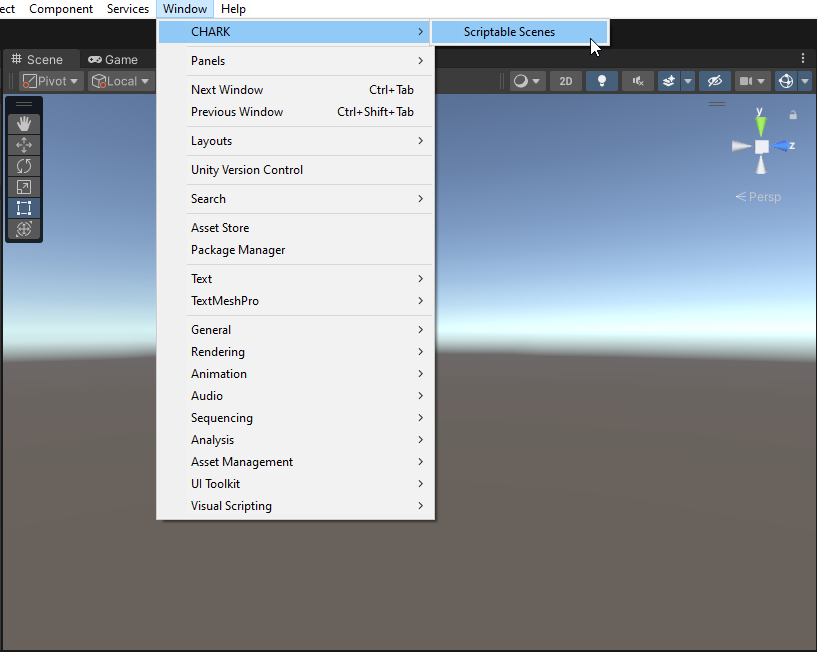
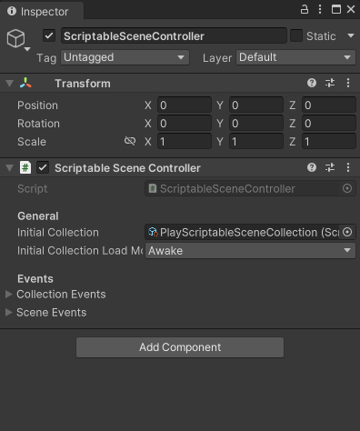

[Unity Package Manager]: https://docs.unity3d.com/Manual/upm-ui.html
[Samples~]: ../Samples%7E
[Defaults Sample]: ../Samples%7E/Defaults
[Changelog]: ../CHANGELOG.md

[Scriptable Scene Window]: ../Editor/ScriptableSceneManagerWindow.cs

[Scriptable Scene]: ../Runtime/ScriptableScene.cs
[Scriptable Scene Collection]: ../Runtime/ScriptableSceneCollection.cs
[Scriptable Scene Controller]: ../Runtime/ScriptableSceneController.cs

[Scriptable Scene Transition]: ../Runtime/Transitions/ScriptableSceneTransition.cs
[Fade Scriptable Scene Transition]: ../Runtime/Transitions/FadeScriptableSceneTransition.cs
[Fade Canvas]: ../Runtime/Transitions/FadeCanvas.cs

# Documentation

This package provides a set of utilities, editor windows and scripts to manage scenes in your Unity projects. It works by setting up a set of assets which can then be used as references to load groups of scenes via editor windows and runtime scripts.

## Getting Started

Open [Unity Package Manager], select _Scriptable Scenes_ package and import [Defaults Sample]:

<p align="center">
  
</p>

Make sure _SetupScene_ and _PlayScene_ are added to _Build Settings_:

<p align="center">
  
</p>

Open [Scriptable Scene Window] by selecting _Window/CHARK/Scriptable Scenes_ menu item:

<p align="center">
  
</p>

This will open an Editor window which allows you to view all [Scriptable Scene Collection] assets present in the project.

The [Defaults Sample] contains a set of [Scriptable Scene] assets and [Scriptable Scene Collection] assets which can be used as a starting point for any project. Additionally, it includes a _SetupScene_ which can be used as a setup/preload scene (e.g., scene for manager classes, XR rig). It also includes components needed for scene loading logic to work, namely the [Scriptable Scene Controller].

If you create new [Scriptable Scene Collection] assets, they will automatically appear in this window. Additionally, you can move, edit or delete the files created by this sample as per your project requirements:

<p align="center">
  
</p>

The following actions can be performed on each entry:

- **Open** - open selected [Scriptable Scene Collection] in scene view & hierarchy.
- **Play** - start the game and load selected [Scriptable Scene Collection].
- **Load** - load selected [Scriptable Scene Collection] during play mode. This is handy to quickly switch between the scenes when the game is running.

**Note**, rearranging entries in this list will only affect your local editor and will not show up in version control.

## Creating New Collection

Instead of importing samples, you can start from scratch and create each asset and component manually.

To create a new collection you'll need the following:

- [Scriptable Scene] asset.
- [Scriptable Scene Collection] asset.
- [Scriptable Scene Controller] component.

And **optionally**:

- [Scriptable Scene Transition] asset.
- [Fade Canvas] component.

### Scriptable Scene

First you'll need to define scenes which go into the collection. Instead of specifying a hard-coded scene path or build index, this package provides a way to safety refer to scenes via Scriptable Objects ([Scriptable Scene] assets).

To create a [Scriptable Scene] asset, right-click anywhere in the _Project Window_ and select _Create/CHARK/Scriptable Scenes/Scriptable Scene_:

<p align="center">
  
  
</p>

After creating, select the asset, set the **Pretty Name** field and specify scene in **Scene Asset** field.

Available properties for customization:

- **Scene Asset** - the `.unity` scene this asset is referring to. Drag in the scene file you want this asset to load.
- **Pretty Name** - user-defined name for the scene. If left blank, a default name will be used.
- **Is Active** - should this scene be [activated](https://docs.unity3d.com/ScriptReference/SceneManagement.SceneManager.SetActiveScene.html) when it gets loaded by a collection? Set this to `true` for main gameplay scenes.
- **Is Persist** - should this scene never be unloaded, even when switching collections? Set this to `true` for setup/preload scenes.
- **Scene Events** - events invoked on this [Scriptable Scene] asset.

### Scriptable Scene Collection

Once you have defined a set of [Scriptable Scene] assets, you'll need to create a [Scriptable Scene Collection] asset which will be used to group and load a set of scenes at the same time. These scenes will be loaded [additively](https://docs.unity3d.com/ScriptReference/SceneManagement.LoadSceneMode.Additive.html).

To create a [Scriptable Scene Collection] asset, right-click in the _Project Window_ and select _Create/CHARK/Scriptable Scenes/Scriptable Scene Collection_:

<p align="center">
  
</p>

Open the asset, set **Pretty Name** and select your [Scriptable Scene] assets which will be loaded by this [Scriptable Scene Collection].

Available properties for customization:

- **Pretty Name** - user-defined name for the collection. If left blank, a default name will be used.
- **Transition** - [Scriptable Scene Transition] asset which can be used to smoothly transition between scenes. If left unset, no transitions will be used.
- **Scriptable Scenes** - [Scriptable Scene] assets to load when this collection is loaded. The order in this list defines the order of scenes in the scene hierarchy.
- **Collection Events** - events invoked on this [Scriptable Scene Collection].
- **Scene Events** - events invoked on any of [Scriptable Scene] assets in this collection.
- **Actions** - set of actions that can be performed with this collection. These are the same actions as in [Scriptable Scene Window].

### Scriptable Scene Controller

Once you have a set of collections ready, do the following in your primary setup/preload scene:

- Create a new _GameObject_.
- Add [Scriptable Scene Controller] component.
- Specify **Initial Collection** to define which collection loads first in build.

<p align="center">
  
</p>

The [Scriptable Scene Controller] component manages scene loading. **You should always have an instance of this component in one of your scenes in order to use this package**. Keep in mind that only one instance of this component may exist in them game, therefore it is recommended to place this component in your setup/preload scene.

You can adjust the following properties on this component:

- **Initial Collection** - [Scriptable Scene Collection] which will be loaded first in build. Usually a set of scenes, such as menu scene or a splash screen scene with the setup scene being the first one.
- **Initial Collection Load Mode** - which Unity Lifecycle method to use when loading the **Initial collection**.
- **Collection Events** - events invoked on any [Scriptable Scene Collection].
- **Scene Events** - events invoked on any [Scriptable Scene].

### Fade Transition (optional)

By default, the package includes a simple fade transition which can be used to fade-in/fade-out a loading screen when switching between scenes (custom transitions can also be created by inheriting [Scriptable Scene Transition] class).

To create a new [Fade Scriptable Scene Transition] asset, right-click in the _Project Window_ and select _Create/CHARK/Scriptable Scenes/Fade Scriptable Scene Transition_:

<p align="center">
  
</p>

You can adjust the following properties on this asset:

- **Fade In Alpha** - alpha value to be set onto the loading screen `Canvas` when a collection starts loading.
- **Fade Out Alpha** - alpha value to be set onto the loading screen `Canvas` when a collection finishes loading.
- **Transition Delay Seconds** - how long to wait before transitioning (fake loading duration).
- **Fade In Duration Seconds** - how long should the fade in effect take.
- **Fade Out Duration Seconds** - how long should the fade out effect take.

Finally, after you have created the [Fade Scriptable Scene Transition] asset, add [Fade Canvas] component onto any `Canvas` which contains loading screen logic in your setup/preload scene:

<p align="center">
  
</p>

Afterward you can reference the [Fade Scriptable Scene Transition] in any of the [Scriptable Scene Collection] assets to enable fading.

## Scripting

### Loading Collections via Code

First you must obtain a reference to a [Scriptable Scene Controller]. This can be done via [SerializeField](https://docs.unity3d.com/ScriptReference/SerializeField.html) or any other means, such as using `Object.FindObjectOfType<ScriptableSceneController>()` and so on, depending on your project setup.

Additionally, you'll need to obtain a set of [Scriptable Scene Collection] references. Since these as Scriptable Objects, all you need to do is define a set of [SerializeField](https://docs.unity3d.com/ScriptReference/SerializeField.html) and load them directly. However, you can load and structure this however you like, e.g., by maintaining lists of scenes, loading them randomly, etc...

```csharp
using CHARK.ScriptableScenes;
using UnityEngine;

internal sealed class GameManager : MonoBehaviour
{
    // Obtain a reference to ScriptableSceneController
    [SerializeField]
    private ScriptableSceneController controller;

    // Obtain a set references to ScriptableSceneCollection
    [SerializeField]
    private ScriptableSceneCollection mainMenuCollection;

    [SerializeField]
    private ScriptableSceneCollection playCollection;

    // Load levels via ScriptableSceneController
    internal void LoadMainMenuLevel()
    {
        controller.LoadSceneCollection(mainMenuCollection);
    }

    internal void LoadPlayLevel()
    {
        controller.LoadSceneCollection(playCollection);
    }
}
```

### APIs

Explore public APIs defined in the following scripts, each `public` method and property is documented and should be self-explanatory:

- [Scriptable Scene]
- [Scriptable Scene Collection]
- [Scriptable Scene Controller]
- [Scriptable Scene Transition]

For breaking changes, keep an eye out for [Changelog].
